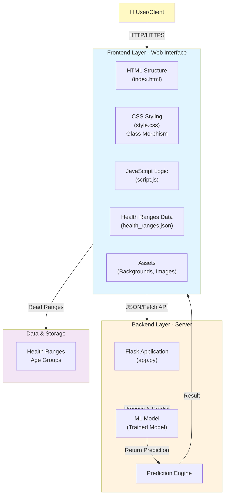
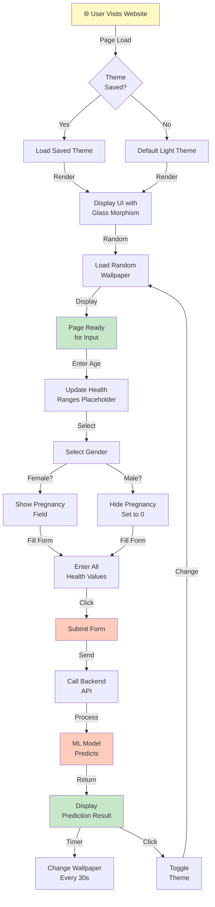

# Diabetes Prediction System - Architecture Documentation

## Table of Contents
1. [High-Level Architecture](#high-level-architecture)
2. [System Components](#system-components)
3. [Data Flow](#data-flow)
4. [Technical Stack](#technical-stack)
5. [Database & Storage](#database--storage)
6. [API Endpoints](#api-endpoints)

---

## High-Level Architecture

### System Overview



---

## System Components

### 1. **Frontend Architecture**

#### HTML (index.html)
- Semantic HTML5 structure
- Form elements for user input
- Dynamic containers for results
- Theme toggle button
- Background container for dynamic wallpapers

#### CSS (style.css)
- **Glass Morphism Design**: Backdrop blur effects, semi-transparent backgrounds
- **Responsive Layout**: Mobile-first design approach
- **Theme System**: Dark/Light theme support with CSS variables
- **Animations**: Smooth transitions and fade effects
- **Interactive Elements**: Hover states, focus states, active states

#### JavaScript (script.js)
- **Event Listeners**: Form submission, input changes, theme toggle
- **DOM Manipulation**: Dynamic placeholder updates
- **API Integration**: Fetch API for backend communication
- **Local Storage**: Theme persistence
- **Background Management**: Random wallpaper selection and rotation

#### JSON Data (health_ranges.json)
- Age-group based health parameters
- 16 age groups (0-5, 5-10, ... 80+)
- Healthy ranges for:
  - Glucose
  - Blood Pressure
  - Skin Thickness
  - Insulin
  - BMI
  - Diabetes Pedigree Function

### 2. **Backend Architecture**

#### Flask Application (app.py)
- HTTP server on port 5000
- CORS enabled for cross-origin requests
- Single prediction endpoint: `/predict`
- Request validation
- Error handling

#### Machine Learning Model
- Algorithm: Logistic Regression (Scikit-learn)
- Training: Uses Pima Indians Diabetes Dataset
- Features: 8 input parameters
- Output: Binary classification (Diabetic/Non-Diabetic)
- Model persistence: Saved as pickle file

### 3. **Data Flow**

```mermaid
graph LR
    A["User Input<br/>Form Data"] -->|Collect Values| B["JavaScript<br/>Validation"]
    B -->|JSON Payload| C["HTTP POST<br/>/predict"]
    C -->|Backend<br/>Receives| D["Flask App"]
    D -->|Feature<br/>Extraction| E["ML Model"]
    E -->|Prediction<br/>Score| F["Result<br/>Processing"]
    F -->|JSON Response| G["Frontend<br/>Display"]
    G -->|Show Result| H["User<br/>Feedback"]
    
    style A fill:#fff9c4
    style B fill:#e1f5ff
    style C fill:#e1f5ff
    style D fill:#fff3e0
    style E fill:#fff3e0
    style F fill:#fff3e0
    style G fill:#e1f5ff
    style H fill:#fff9c4
```



---

## Technical Stack

| Layer | Technology | Purpose |
|-------|-----------|---------|
| **Frontend** | HTML5 | Markup & Structure |
| | CSS3 | Styling & Animations |
| | JavaScript (Vanilla) | Interactivity & Logic |
| | Fetch API | HTTP Communication |
| **Backend** | Python 3.x | Server Logic |
| | Flask | Web Framework |
| | Scikit-learn | ML Library |
| | Pandas | Data Processing |
| **Storage** | JSON | Configuration Data |
| **Deployment** | Local/HTTP | Development |

---

## Database & Storage

### health_ranges.json Structure

```json
{
  "ageGroups": [
    {
      "min": 0,
      "max": 5,
      "label": "0-5 years",
      "glucose": { "min": 70, "max": 100 },
      "bloodPressure": { "min": 90, "max": 110 },
      "skinThickness": { "min": 12, "max": 20 },
      "insulin": { "min": 50, "max": 100 },
      "bmi": { "min": 13, "max": 16 },
      "pedigree": { "min": 0.1, "max": 0.3 }
    }
    // ... more age groups
  ]
}
```

### ML Model Storage
- **Format**: Pickle binary format
- **Location**: Backend directory
- **Size**: Minimal (Logistic Regression)
- **Loading**: On application startup

---

## API Endpoints

### POST /predict

**Request Format:**
```json
{
  "age": 50,
  "pregnancies": 0,
  "glucose": 150,
  "bp": 78,
  "skin": 31,
  "insulin": 130,
  "bmi": 29,
  "pedigree": 0.16
}
```

**Response Format (Success):**
```json
{
  "prediction": "Diabetic",
  "probability": 0.85,
  "confidence": "High"
}
```

**Response Format (Error):**
```json
{
  "error": "Invalid input",
  "message": "Age must be positive"
}
```

---

## User Journey Flow



---

## File Structure

```
meow/
├── interface/
│   ├── index.html           # Main HTML file
│   ├── style.css            # Styling (Glass Morphism)
│   ├── script.js            # Frontend logic
│   ├── app.py               # Flask backend
│   ├── health_ranges.json   # Age-group health data
│   └── requirements.txt      # Python dependencies
│
├── ml/
│   ├── model.pkl            # Trained ML model
│   └── requirements.txt      # ML dependencies
│
├── public/
│   └── img/
│       └── background/      # Background images
│           ├── light 01.jpg
│           ├── dark 01.jpg
│           └── dark 02.jpg
│
└── docs/                    # Documentation
    ├── ARCHITECTURE.md      # This file
    ├── DESIGN.md            # System design details
    └── future-improvements/
        └── DYNAMIC_RANGES.md # Future enhancement plans
```

---

## Security Considerations

1. **Input Validation**: All user inputs are validated on the frontend and backend
2. **CORS**: Enabled for localhost testing (restrict in production)
3. **Data Privacy**: No user data is stored permanently
4. **Model Safety**: ML model is read-only, cannot be retrained via API

---

## Performance Metrics

- **Page Load Time**: < 2 seconds
- **API Response Time**: < 500ms
- **Model Prediction Time**: < 100ms
- **Wallpaper Change Animation**: 1s
- **Theme Toggle**: Instant (cached)

---

## Future Enhancements

See [future-improvements/DYNAMIC_RANGES.md](./future-improvements/DYNAMIC_RANGES.md) for:
- Dynamic range manipulation based on user input
- Cross-validation of ranges
- Advanced ML model improvements
- Real-time feedback system

---

**Last Updated**: December 8, 2025
**Version**: 1.0
**Status**: Production Ready
