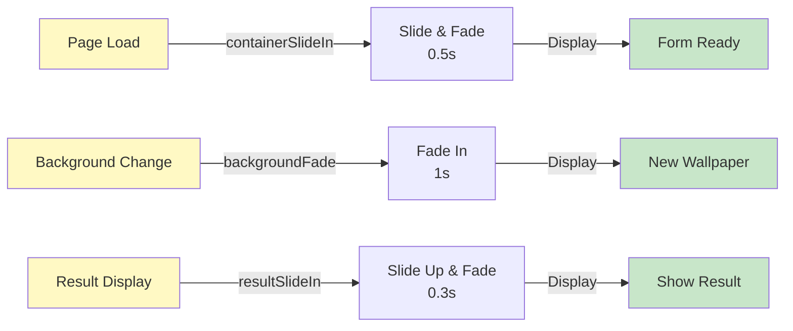
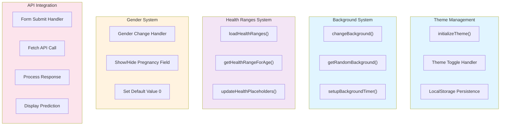
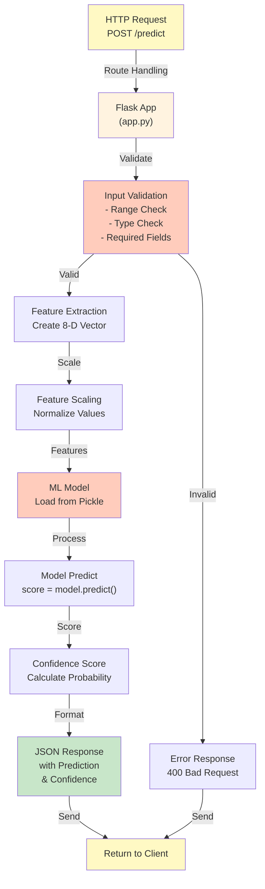
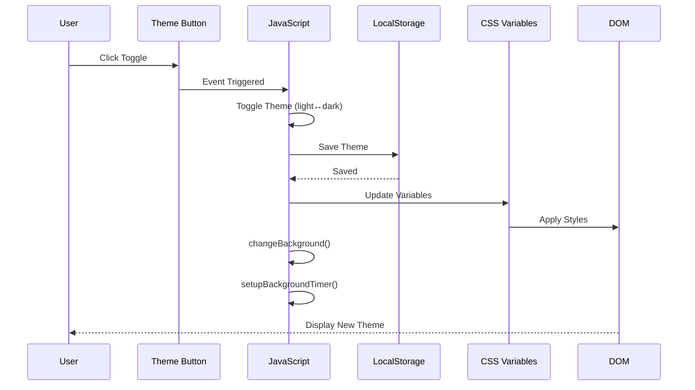
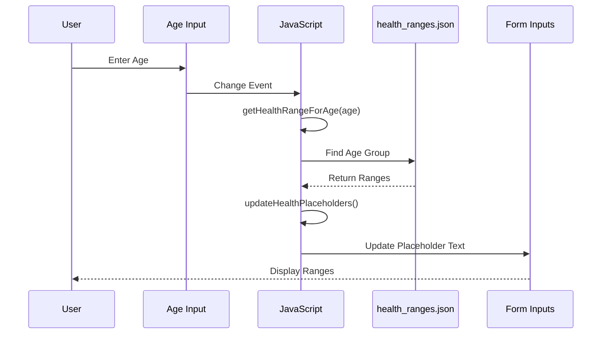
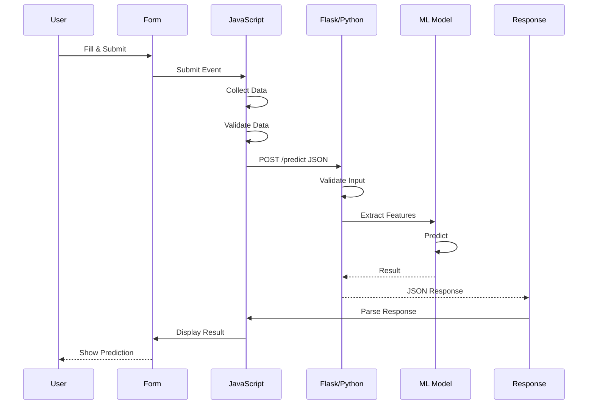
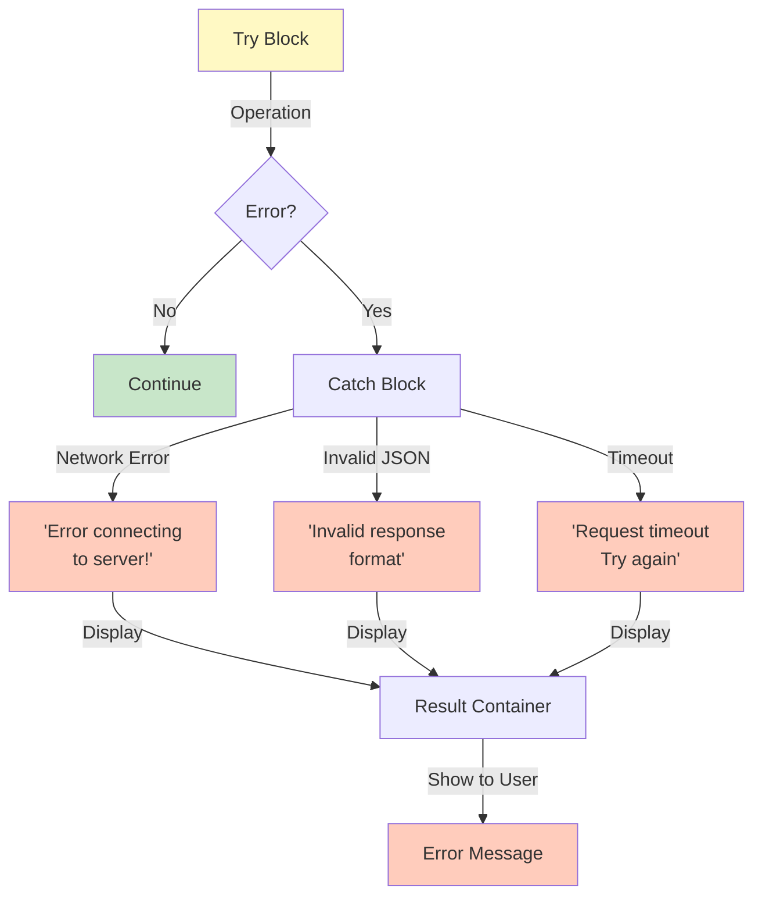

# Low-Level System Design

## Table of Contents
1. [Frontend System Design](#frontend-system-design)
2. [Backend System Design](#backend-system-design)
3. [Component Interactions](#component-interactions)
4. [State Management](#state-management)
5. [Error Handling](#error-handling)

---

## Frontend System Design

### HTML Structure Hierarchy

```mermaid
graph TD
    HTML["<html>"]
    
    HEAD["<head>"]
    BODY["<body>"]
    
    HTML --> HEAD
    HTML --> BODY
    
    HEAD --> META["Meta Tags<br/>(Charset, Viewport)"]
    HEAD --> TITLE["Title Tag"]
    HEAD --> CSS["Link to CSS"]
    
    BODY --> BGCONTAINER["Background Container<br/>id: backgroundContainer"]
    BODY --> THEMETOGGLE["Theme Toggle Button<br/>id: themeToggle"]
    BODY --> CONTAINER["Main Container<br/>class: container"]
    BODY --> SCRIPT["Script Tag"]
    
    CONTAINER --> TITLE_H1["<h1>Title</h1>"]
    CONTAINER --> FORM["<form id: predictionForm>"]
    CONTAINER --> RESULT["<div id: result>"]
    
    FORM --> AGE["Age Input"]
    FORM --> GENDERROW["Gender & Pregnancies Row"]
    FORM --> GLUCOSE["Glucose Input"]
    FORM --> BP["Blood Pressure Input"]
    FORM --> SKIN["Skin Thickness Input"]
    FORM --> INSULIN["Insulin Input"]
    FORM --> BMI["BMI Input"]
    FORM --> PEDIGREE["Pedigree Input"]
    FORM --> BUTTON["Submit Button"]
    
    GENDERROW --> GENDERFIELD["Gender Select"]
    GENDERROW --> PREGNANCYFIELD["Pregnancies Select<br/>Hidden by default"]
    
    style HTML fill:#e3f2fd
    style FORM fill:#fff3e0
    style CONTAINER fill:#f3e5f5
```



### CSS Architecture

#### 1. **CSS Variables (Theme System)**
```css
:root {
  --primary-color: #3498db;
  --primary-hover: #2980b9;
  --text-color: #2c3e50;
  --bg-overlay: rgba(255, 255, 255, 0.15);
  --glass-border: rgba(255, 255, 255, 0.2);
}

body.dark-theme {
  --text-color: #ecf0f1;
  --bg-overlay: rgba(0, 0, 0, 0.3);
  --glass-border: rgba(255, 255, 255, 0.1);
}
```

#### 2. **Glass Morphism Implementation**
```
.container {
  background: var(--bg-overlay);
  backdrop-filter: blur(20px);
  -webkit-backdrop-filter: blur(20px);
  border: 1px solid var(--glass-border);
  border-radius: 20px;
}
```

**Key Properties:**
- `backdrop-filter: blur(20px)` - Creates glass effect
- `background: rgba(...)` - Semi-transparent color
- `border: 1px solid rgba(...)` - Subtle border
- Fallback for older browsers using `-webkit-` prefix

#### 3. **Animation System**



### JavaScript Module Structure



---

## Backend System Design

### Flask Application Architecture



### ML Model Pipeline

```python
# Input: 8 features
features = [
    age,           # 0-100
    pregnancies,   # 0-5+
    glucose,       # 0-200+
    bloodPressure, # 0-200
    skinThickness, # 0-100
    insulin,       # 0-300+
    bmi,           # 0-60+
    pedigree       # 0.0-2.0+
]

# Processing
normalized_features = scaler.transform(features)

# Prediction
prediction = model.predict(normalized_features)  # 0 or 1

# Confidence
probability = model.predict_proba(normalized_features)[0]
confidence = max(probability)

# Output
response = {
    "prediction": "Diabetic" if prediction[0] == 1 else "Non-Diabetic",
    "probability": round(probability[1], 2),
    "confidence": "High" if confidence > 0.8 else "Medium" if confidence > 0.6 else "Low"
}
```

---

## Component Interactions

### 1. **Theme Toggle Flow**



### 2. **Age Input & Placeholder Update**



### 3. **Form Submission & Prediction**



---

## State Management

### Frontend State Variables

```javascript
// Theme State
currentTheme: 'light' | 'dark'  // Persisted in localStorage

// Background State
backgroundChangeTimer: IntervalID  // Timer for automatic rotation
BACKGROUND_CHANGE_INTERVAL: 30000  // 30 seconds

// Health Data State
healthRanges: Array<AgeGroup>  // Loaded from JSON

// Form State
age: number
gender: 'male' | 'female' | ''
pregnancies: 0 | 1 | 2 | 3 | 4 | 5
glucose: number
bp: number
skin: number
insulin: number
bmi: number
pedigree: number
```

### Backend State

```python
# Model State
model: LogisticRegression  # Loaded once on startup
scaler: StandardScaler     # Feature scaling

# Request State
input_data: dict           # User submitted data
features: np.array         # Extracted features
prediction: int            # 0 or 1
probability: float         # Confidence score
```

---

## Error Handling

### Frontend Error Handling



### Backend Error Handling

```python
@app.route('/predict', methods=['POST'])
def predict():
    try:
        data = request.json
        
        # Validation
        required_fields = ['age', 'pregnancies', 'glucose', ...]
        for field in required_fields:
            if field not in data:
                return {'error': 'Missing field', 'field': field}, 400
        
        # Type & Range Validation
        if not isinstance(data['age'], (int, float)):
            return {'error': 'Age must be a number'}, 400
        
        if data['age'] < 0 or data['age'] > 120:
            return {'error': 'Age must be between 0 and 120'}, 400
        
        # Processing
        features = extract_features(data)
        prediction = model.predict([features])[0]
        
        return {
            'prediction': 'Diabetic' if prediction == 1 else 'Non-Diabetic',
            'status': 'success'
        }, 200
    
    except Exception as e:
        return {'error': str(e)}, 500
```

---

## Data Validation Rules

| Field | Type | Min | Max | Required |
|-------|------|-----|-----|----------|
| age | number | 0 | 120 | ✓ |
| pregnancies | number | 0 | 5 | ✓ |
| glucose | number | 0 | 300 | ✓ |
| bp | number | 0 | 250 | ✓ |
| skin | number | 0 | 100 | ✓ |
| insulin | number | 0 | 500 | ✓ |
| bmi | number | 0 | 60 | ✓ |
| pedigree | number | 0.0 | 2.5 | ✓ |
| gender | string | - | - | ✓ |

---

**Last Updated**: December 8, 2025
**Version**: 1.0
