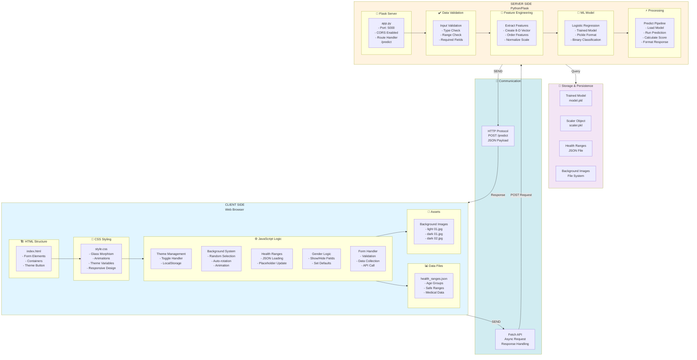
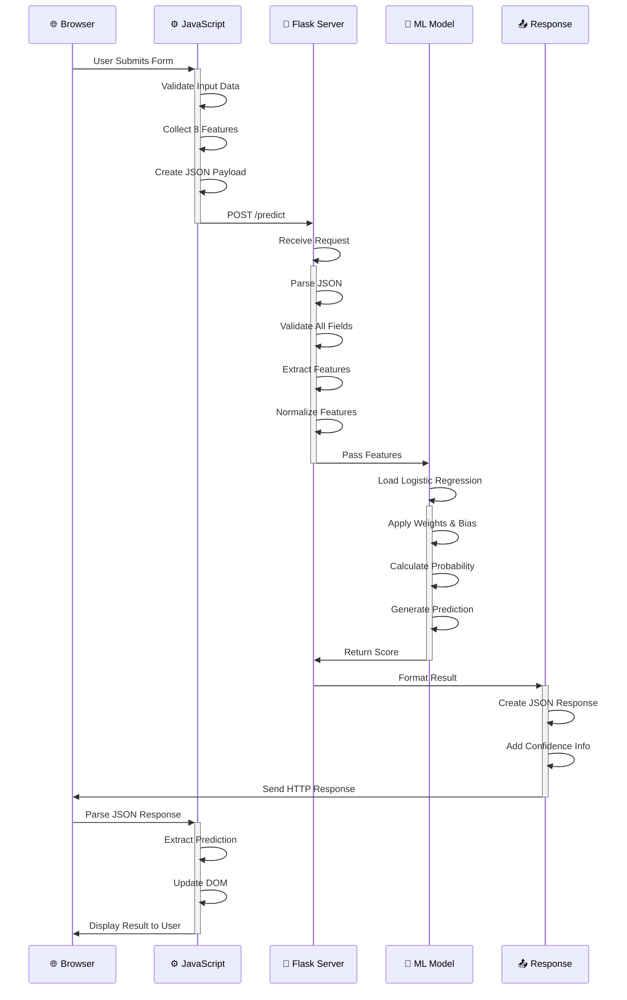
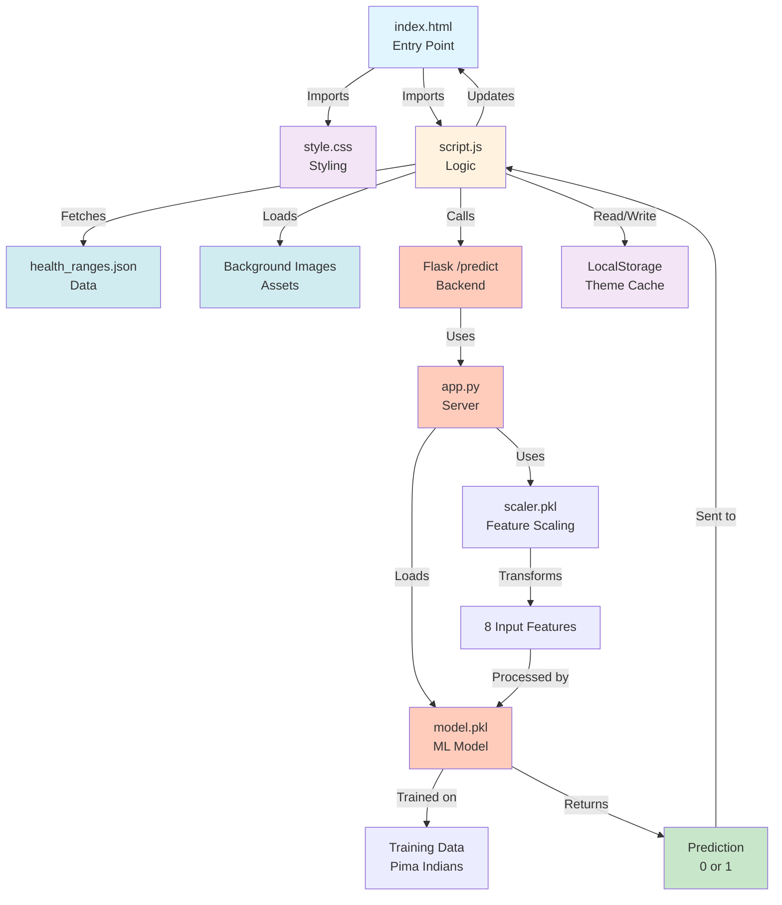
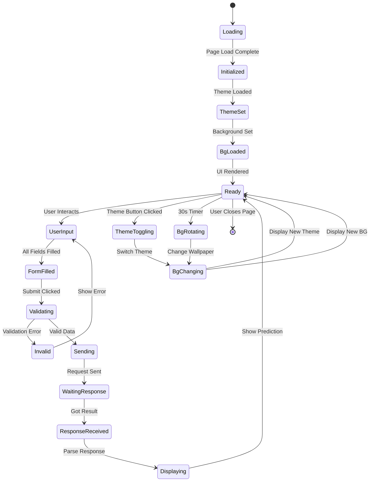
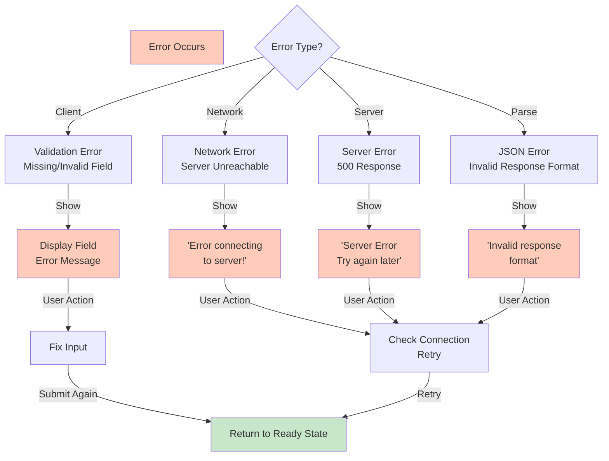

# Complete Project Flow & Architecture Diagrams

## Table of Contents
1. [Complete System Flow](#complete-system-flow)
2. [User Journey Flowchart](#user-journey-flowchart)
3. [Technical Architecture Diagram](#technical-architecture-diagram)
4. [Data Flow Visualization](#data-flow-visualization)
5. [Component Dependency Graph](#component-dependency-graph)

---

## Complete System Flow

### End-to-End Process Flow

```mermaid
graph TB
    A["👤 User Visits Website<br/>localhost:5000"]
    
    subgraph Browser["🌐 Web Browser"]
        B["HTML Loaded<br/>index.html"]
        C["CSS Applied<br/>style.css"]
        D["JavaScript Executed<br/>script.js"]
        E["Load JSON Data<br/>health_ranges.json"]
        
        B -->|Parse| C
        C -->|Render| D
        D -->|Fetch| E
    end
    
    subgraph ThemeInit["🎨 Theme Initialization"]
        F["Check LocalStorage<br/>for Saved Theme"]
        G{"Theme<br/>Exists?"}
        H["Use Saved Theme"]
        I["Use Default Light"]
        J["Apply CSS Variables"]
        K["Load Random Background"]
        
        F -->|Check| G
        G -->|Yes| H
        G -->|No| I
        H --> J
        I --> J
        J -->|Select| K
    end
    
    subgraph UIReady["✅ UI Ready"]
        L["Display Styled<br/>Container"]
        M["Show Form Inputs"]
        N["Display Theme<br/>Toggle Button"]
        O["Background Image<br/>Set & Animated"]
        
        K --> L
        L --> M
        L --> N
        L --> O
    end
    
    subgraph UserInteraction["👆 User Interaction"]
        P["User Enters Age"]
        Q["JavaScript Listener<br/>Triggered"]
        R["Search Age Group<br/>in health_ranges.json"]
        S["Update Input<br/>Placeholders"]
        
        P --> Q
        Q --> R
        R --> S
        
        T["User Selects Gender"]
        U{"Female?"}
        V["Show Pregnancies<br/>Select Field"]
        W["Hide Pregnancies<br/>Set to 0"]
        
        T -->|Input| U
        U -->|Yes| V
        U -->|No| W
        
        X["User Fills<br/>All Fields"]
        Y["User Clicks<br/>Predict Button"]
        
        S -->|Continue| X
        V -->|Continue| X
        W -->|Continue| X
        X --> Y
    end
    
    subgraph FormSubmit["📤 Form Submission"]
        Z["JavaScript Collects<br/>All Values"]
        AA["Validate Data<br/>Client-side"]
        AB{"Valid?"}
        AC["Show Validation<br/>Error"]
        AD["Create JSON<br/>Payload"]
        
        Y --> Z
        Z --> AA
        AA -->|Check| AB
        AB -->|No| AC
        AB -->|Yes| AD
    end
    
    subgraph APICall["🔗 API Communication"]
        AE["POST /predict<br/>to Backend"]
        AF["Flask Receives<br/>Request"]
        AG["Validate Input<br/>Backend"]
        AH{"Valid?"}
        AI["Return 400<br/>Error Response"]
        AJ["Extract Features<br/>Create Vector"]
        
        AD -->|Send| AE
        AE -->|Receive| AF
        AF -->|Check| AG
        AG -->|Validation| AH
        AH -->|No| AI
        AH -->|Yes| AJ
    end
    
    subgraph MLPrediction["🤖 Machine Learning"]
        AK["Load Trained<br/>Model from Pickle"]
        AL["Normalize Features<br/>using Scaler"]
        AM["Model.predict()"]
        AN["Get Prediction<br/>0 = Non-Diabetic<br/>1 = Diabetic"]
        AO["Calculate<br/>Confidence Score"]
        AP["Format JSON<br/>Response"]
        
        AJ --> AK
        AK --> AL
        AL --> AM
        AM --> AN
        AN --> AO
        AO --> AP
    end
    
    subgraph ResponseHandle["📥 Response Handling"]
        AQ["Frontend Receives<br/>Response"]
        AR["Parse JSON<br/>Extract Prediction"]
        AS["Display Result<br/>in Result Container"]
        AT["Update UI with<br/>Prediction Text"]
        
        AP -->|Return| AQ
        AQ --> AR
        AR --> AS
        AS --> AT
    end
    
    subgraph Continuous["♻️ Continuous Operations"]
        AU["Timer Event<br/>Every 30s"]
        AV["Change Background<br/>Random Wallpaper"]
        AW["Fade Animation"]
        
        AU -->|Trigger| AV
        AV --> AW
        
        AX["Theme Toggle<br/>Button Clicked"]
        AY["Switch Theme<br/>Light ↔ Dark"]
        AZ["Update CSS Variables"]
        BA["Change Wallpaper"]
        BB["Save to LocalStorage"]
        
        AX -->|Click| AY
        AY --> AZ
        AZ --> BA
        BB -->|Save| BB
    end
    
    A --> Browser
    Browser --> ThemeInit
    ThemeInit --> UIReady
    UIReady --> UserInteraction
    UserInteraction --> FormSubmit
    FormSubmit --> APICall
    APICall --> MLPrediction
    MLPrediction --> ResponseHandle
    ResponseHandle -->|Continuous| Continuous
    
    style A fill:#fff9c4
    style Browser fill:#e1f5ff
    style ThemeInit fill:#f3e5f5
    style UIReady fill:#c8e6c9
    style UserInteraction fill:#fff3e0
    style FormSubmit fill:#ffccbc
    style APICall fill:#ffccbc
    style MLPrediction fill:#ffccbc
    style ResponseHandle fill:#c8e6c9
    style Continuous fill:#d1c4e9
```



---

## User Journey Flowchart

### Detailed User Interaction Flow

```mermaid
flowchart TD
    Start["🌐 User Opens Website"]
    
    Start -->|Page Loads| A["Browser Loads<br/>HTML/CSS/JS"]
    
    A -->|Initialize| B["Check Saved Theme<br/>in LocalStorage"]
    
    B -->|Yes| C["Apply Dark Theme"]
    B -->|No| D["Apply Light Theme"]
    
    C -->|Load| E["Select Dark<br/>Background Images"]
    D -->|Load| F["Select Light<br/>Background Images"]
    
    E -->|Random| G["Load Random<br/>Background Image"]
    F -->|Random| G
    
    G -->|Display| H["🎨 UI Renders<br/>with Glass Morphism"]
    
    H -->|Show| I["Form Ready<br/>All Inputs Empty"]
    
    I -->|Action 1| J["User Enters Age<br/>e.g., 50"]
    
    J -->|Trigger| K["JavaScript Event<br/>Listener: onChange"]
    
    K -->|Process| L["Find Age Group<br/>50-55 years"]
    
    L -->|Lookup| M["Get Healthy Ranges<br/>from JSON"]
    
    M -->|Update| N["Update All Input<br/>Placeholders<br/>Glucose: 95-150<br/>BP: 115-155<br/>etc..."]
    
    N -->|Display| O["User Sees<br/>Healthy Ranges"]
    
    O -->|Action 2| P["User Selects Gender<br/>Male/Female"]
    
    P -->|Condition| Q{"Select<br/>Female?"}
    
    Q -->|Yes| R["Show Pregnancies<br/>Select Dropdown"]
    Q -->|No| S["Hide Pregnancies<br/>Set Value = 0"]
    
    R -->|Input| T["User Fills<br/>All Fields<br/>with Values"]
    S -->|Input| T
    
    T -->|Review| U["User Reviews<br/>All Inputs"]
    
    U -->|Action 3| V["Click<br/>PREDICT Button"]
    
    V -->|Collect| W["JavaScript Collects<br/>Form Data"]
    
    W -->|Validate| X{"All Fields<br/>Valid?"}
    
    X -->|No| Y["Show Error<br/>Message"]
    Y -->|Fix| T
    X -->|Yes| Z["Create JSON Payload<br/>with 8 features"]
    
    Z -->|Send| AA["HTTP POST<br/>/predict endpoint<br/>to Flask Server"]
    
    AA -->|Receive| AB["Backend Validates<br/>Input Data"]
    
    AB -->|Process| AC["Extract Features<br/>Create 8-D Vector"]
    
    AC -->|Normalize| AD["Apply Feature<br/>Scaling"]
    
    AD -->|Predict| AE["ML Model<br/>Predicts"]
    
    AE -->|Result| AF{"Prediction<br/>Result"}
    
    AF -->|Return| AG["Format JSON<br/>Response"]
    
    AG -->|Send Back| AH["Frontend Receives<br/>Response"]
    
    AH -->|Parse| AI["Extract Prediction<br/>'Diabetic' or<br/>'Non-Diabetic'"]
    
    AI -->|Display| AJ["🎯 SHOW RESULT<br/>Prediction: Diabetic"]
    
    AJ -->|Continue| AK["User Can<br/>Submit Again"]
    
    AK -->|Action 4| AL["Click Theme<br/>Toggle Button"]
    
    AL -->|Switch| AM["Toggle<br/>Light ↔ Dark"]
    
    AM -->|Update| AN["CSS Variables<br/>Change"]
    
    AN -->|Effect| AO["Background Fades"]
    AO -->|Select| AP["New Random<br/>Background"]
    
    AP -->|Display| AQ["Page Shows<br/>New Theme"]
    
    AQ -->|Continuous| AR["Timer Runs<br/>Every 30 seconds"]
    
    AR -->|Change| AS["Auto-change<br/>Wallpaper"]
    
    AS -->|Animation| AT["Fade In Animation<br/>New Background"]
    
    AT -->|Loop| AR
    
    style Start fill:#fff9c4
    style H fill:#c8e6c9
    style I fill:#c8e6c9
    style N fill:#d1ecf1
    style T fill:#fff3e0
    style V fill:#ffccbc
    style AJ fill:#c8e6c9
    style AQ fill:#c8e6c9
```



---

## Technical Architecture Diagram

### Complete System Architecture



---

## Data Flow Visualization

### Request-Response Cycle



---

## Component Dependency Graph

### Module Dependencies



---

## State Machine Diagram

### Application State Transitions



---

## Error Handling Flow

### Error Management Path



---

## Performance Flow

### Load & Execution Timeline

```mermaid
gantt
    title Application Load Timeline
    
    section Browser
    Page Request           :a1, 0ms, 100ms
    HTML Parse            :a2, 100ms, 200ms
    CSS Load & Parse      :a3, 100ms, 300ms
    
    section JavaScript
    Script Load           :b1, 200ms, 300ms
    DOM Ready            :b2, 300ms, 350ms
    Health Ranges Fetch  :b3, 350ms, 500ms
    
    section Rendering
    Initial Render       :c1, 300ms, 600ms
    Theme Apply          :c2, 500ms, 700ms
    Background Load      :c3, 500ms, 1000ms
    
    section Ready State
    Page Ready           :d1, 1000ms, 1100ms
    User Interaction     :d2, 1100ms, 10000ms
    
    section API Call
    Form Submit          :e1, 3000ms, 3100ms
    Network Request      :e2, 3100ms, 3500ms
    Server Processing    :e3, 3500ms, 3600ms
    Response Return      :e4, 3600ms, 4000ms
    DOM Update           :e5, 4000ms, 4200ms
    Result Display       :e6, 4200ms, 4500ms
```

---

**Last Updated**: December 8, 2025
**Version**: 1.0
**Diagrams**: Mermaid
**Status**: Complete Documentation
