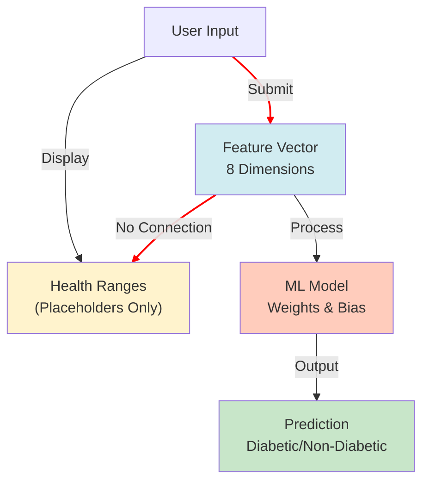
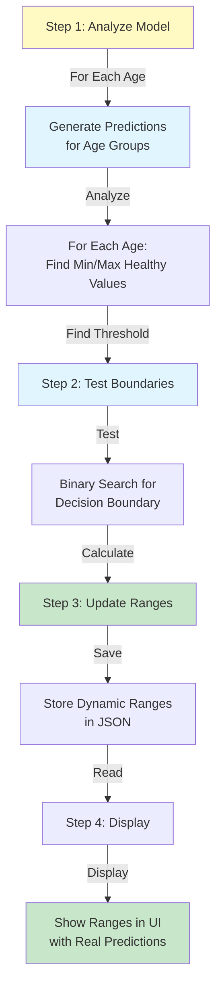
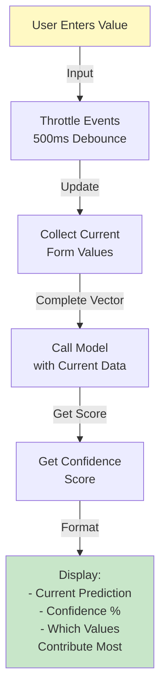
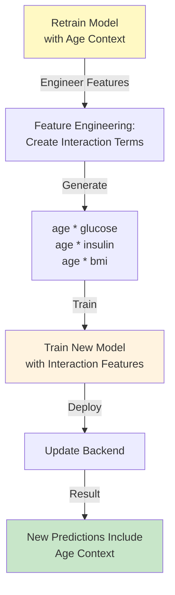
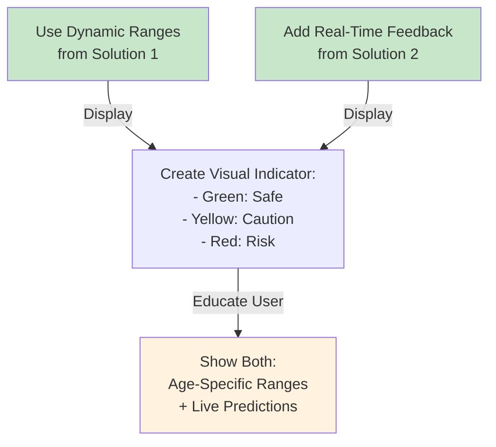

# Future Improvements & Problem Solving

## Current Problem Analysis

### Problem Statement

**Issue**: Users entering values within the "healthy range" for their age still receive "Diabetic" predictions.

**Root Cause**: The healthy ranges shown as placeholders are **static reference values** for general information only. They do NOT directly influence the ML model's prediction. The model operates independently based on the trained weights and does not use age-specific thresholds.

**Example Scenario**:
```
User Age: 50
Shown Healthy Range for Glucose: 95-150
User Enters Glucose: 120 (within range)
ML Model Prediction: Still "Diabetic"
```

**Why This Happens**:
1. The healthy ranges are educational/informational placeholders
2. The ML model uses a trained Logistic Regression classifier
3. The classifier has learned patterns from training data (Pima Indians Dataset)
4. These patterns may show that even "healthy" individual metrics can indicate diabetes when combined with other factors
5. The model evaluates the **complete feature vector**, not individual ranges

---

## Technical Breakdown

### Current Implementation



**Key Issue**: The red lines show NO connection between displayed ranges and model prediction!

### Model's Decision Logic

```
Prediction = sigmoid(
    w₀ * age + 
    w₁ * pregnancies + 
    w₂ * glucose + 
    w₃ * bp + 
    w₄ * skin + 
    w₅ * insulin + 
    w₆ * bmi + 
    w₇ * pedigree + 
    bias
)

IF Prediction > 0.5 THEN "Diabetic"
ELSE "Non-Diabetic"
```

The model uses **learned weights** from training, not predefined age ranges!

---

## Proposed Solutions

### Solution 1: Interactive Range Adjuster (Recommended)

#### Description
Dynamically adjust displayed ranges based on actual model behavior for each age group.

#### Implementation Strategy



#### New JSON Structure
```json
{
  "ageGroups": [
    {
      "min": 50,
      "max": 55,
      "label": "50-55 years",
      "ranges": {
        "glucose": {
          "min": 95,
          "max": 150,
          "model_safe_max": 155,
          "description": "Below 155 is generally safe for this age"
        },
        "bloodPressure": {
          "min": 115,
          "max": 155,
          "model_safe_max": 160,
          "description": "Below 160 is generally safe for this age"
        }
        // ... other fields
      }
    }
  ]
}
```

#### Implementation Steps

**Step 1: Boundary Detection Script**
```python
# Python script to run once and generate new ranges
import numpy as np
from sklearn.linear_model import LogisticRegression
import json

def find_safe_boundary(model, age, feature_index, step=1):
    """
    Binary search to find max safe value for a feature at given age
    """
    low, high = 50, 300
    safe_value = low
    
    while low <= high:
        mid = (low + high) // 2
        
        # Create test features with base values
        test_features = create_base_features_for_age(age)
        test_features[feature_index] = mid
        
        # Predict
        prediction = model.predict([test_features])[0]
        
        if prediction == 0:  # Non-diabetic (safe)
            safe_value = mid
            low = mid + 1
        else:  # Diabetic (not safe)
            high = mid - 1
    
    return safe_value

# Generate dynamic ranges
def generate_dynamic_ranges(model):
    ranges = []
    
    for age in range(0, 100, 5):
        age_range = {
            "min": age,
            "max": age + 5,
            "label": f"{age}-{age+5} years",
            "ranges": {
                "glucose": find_safe_boundary(model, age, 2),
                "bp": find_safe_boundary(model, age, 3),
                # ... other features
            }
        }
        ranges.append(age_range)
    
    return ranges
```

**Step 2: Update Frontend Logic**
```javascript
function updateDynamicPlaceholders(age) {
    const range = getHealthRangeForAge(age);
    
    if (!range) return;
    
    document.getElementById("glucose").placeholder = 
        `Safe for your age: ${range.ranges.glucose.min}-${range.ranges.glucose.model_safe_max}`;
    
    // Add visual indicator for model-safe ranges
    addRangeIndicator("glucose", range.ranges.glucose);
}

function addRangeIndicator(fieldId, rangeData) {
    const input = document.getElementById(fieldId);
    
    // Change border color based on input value
    input.addEventListener("input", function() {
        const value = parseFloat(this.value);
        
        if (value > rangeData.model_safe_max) {
            this.style.borderColor = "#ff6b6b";  // Red
            this.setAttribute("data-warning", "Above safe range");
        } else if (value > rangeData.max) {
            this.style.borderColor = "#ffd93d";  // Yellow
            this.setAttribute("data-warning", "Slightly elevated");
        } else {
            this.style.borderColor = "#6bcf7f";  // Green
            this.removeAttribute("data-warning");
        }
    });
}
```

#### Pros & Cons
| Aspect | Rating | Details |
|--------|--------|---------|
| **Accuracy** | ⭐⭐⭐⭐⭐ | Directly uses model to determine safe ranges |
| **User Clarity** | ⭐⭐⭐⭐⭐ | Ranges match actual model behavior |
| **Maintainability** | ⭐⭐⭐⭐ | One-time generation, easy to regenerate |
| **Complexity** | ⭐⭐⭐ | Moderate - requires boundary detection |
| **Performance** | ⭐⭐⭐⭐⭐ | No runtime overhead |

---

### Solution 2: Real-Time Prediction Feedback

#### Description
Show live prediction updates as user types values, highlighting how each value affects the outcome.

#### Implementation Approach



#### Code Example
```javascript
// Debounce prediction for performance
const debounce = (func, delay) => {
    let timeout;
    return (...args) => {
        clearTimeout(timeout);
        timeout = setTimeout(() => func(...args), delay);
    };
};

const debouncedPredict = debounce(async function() {
    // Get all current values
    const data = {
        age: document.getElementById("age").value,
        pregnancies: document.getElementById("pregnancies").value,
        glucose: document.getElementById("glucose").value,
        bp: document.getElementById("bp").value,
        skin: document.getElementById("skin").value,
        insulin: document.getElementById("insulin").value,
        bmi: document.getElementById("bmi").value,
        pedigree: document.getElementById("pedigree").value
    };
    
    // Only predict if most fields are filled
    if (Object.values(data).filter(v => v !== '').length >= 6) {
        try {
            const response = await fetch("http://127.0.0.1:5000/predict", {
                method: "POST",
                headers: { "Content-Type": "application/json" },
                body: JSON.stringify(data)
            });
            
            const result = await response.json();
            
            // Show live prediction
            displayLivePreview(result);
        } catch (error) {
            console.log("Live preview unavailable");
        }
    }
}, 500);

// Attach to all inputs
document.querySelectorAll("input, select").forEach(el => {
    el.addEventListener("input", debouncedPredict);
    el.addEventListener("change", debouncedPredict);
});

function displayLivePreview(result) {
    const preview = document.getElementById("livePreview");
    preview.innerHTML = `
        <p>Current Prediction: <strong>${result.prediction}</strong></p>
        <p>Confidence: ${(result.probability * 100).toFixed(1)}%</p>
        <small>This updates as you type...</small>
    `;
}
```

#### Pros & Cons
| Aspect | Rating | Details |
|--------|--------|---------|
| **User Experience** | ⭐⭐⭐⭐⭐ | Real-time feedback is engaging |
| **Accuracy** | ⭐⭐⭐⭐⭐ | Always accurate to model |
| **Transparency** | ⭐⭐⭐⭐⭐ | Shows impact of each input |
| **Complexity** | ⭐⭐⭐ | Moderate - requires debouncing |
| **Performance** | ⭐⭐⭐ | May increase server load |

---

### Solution 3: Context-Aware Model (Advanced)

#### Description
Enhance the ML model to include age-weighted decision boundaries.

#### Implementation Approach



#### Code Example
```python
from sklearn.preprocessing import PolynomialFeatures

# Original features
original_features = ['age', 'pregnancies', 'glucose', 'bp', 'skin', 'insulin', 'bmi', 'pedigree']

# Create interaction features
poly = PolynomialFeatures(degree=2, include_bias=False, interaction_only=True)

# Generate interactions
X_interactions = poly.fit_transform(X_train)

# Train new model
new_model = LogisticRegression()
new_model.fit(X_interactions, y_train)

# Now predictions are age-aware!
# Example: High glucose is riskier for younger people
```

#### Pros & Cons
| Aspect | Rating | Details |
|--------|--------|---------|
| **Accuracy** | ⭐⭐⭐⭐⭐ | More contextual predictions |
| **Complexity** | ⭐⭐⭐⭐ | Requires data science expertise |
| **Maintainability** | ⭐⭐⭐ | Harder to debug & update |
| **Performance** | ⭐⭐⭐⭐ | Slightly slower predictions |
| **Data Quality** | ⭐⭐⭐⭐ | Requires good quality training data |

---

### Solution 4: Hybrid Approach (Best Practice)

Combine Solutions 1 & 2 for optimal UX:



---

## Implementation Roadmap

### Phase 1: Short-term (v1.1)
- [ ] Generate dynamic ranges using Solution 1
- [ ] Update health_ranges.json with model-based safe values
- [ ] Add visual range indicators (color-coded borders)
- [ ] Update UI documentation

**Timeline**: 1-2 weeks
**Effort**: Medium
**Impact**: High ⭐⭐⭐⭐⭐

### Phase 2: Medium-term (v1.2)
- [ ] Implement real-time prediction (Solution 2)
- [ ] Add live preview section
- [ ] Implement debouncing for performance
- [ ] Add confidence score display

**Timeline**: 2-3 weeks
**Effort**: Medium
**Impact**: High ⭐⭐⭐⭐

### Phase 3: Long-term (v2.0)
- [ ] Collect more diverse training data
- [ ] Implement context-aware model (Solution 3)
- [ ] A/B test with users
- [ ] Continuous model improvement

**Timeline**: 6-12 months
**Effort**: High
**Impact**: Very High ⭐⭐⭐⭐⭐

---

## Testing Strategy

### Unit Tests
```python
# Test boundary detection
def test_find_safe_boundary():
    model = load_trained_model()
    age = 50
    
    safe_glucose = find_safe_boundary(model, age, feature_index=2)
    
    # Create features at boundary
    features_safe = create_features(age, glucose=safe_glucose)
    features_unsafe = create_features(age, glucose=safe_glucose+1)
    
    assert model.predict([features_safe])[0] == 0  # Non-diabetic
    assert model.predict([features_unsafe])[0] == 1  # Diabetic
```

### Integration Tests
```javascript
// Test dynamic placeholder updates
describe("Dynamic Ranges", () => {
    it("should update placeholder for age 50", () => {
        const input = document.getElementById("glucose");
        
        // Simulate entering age 50
        updateHealthPlaceholders(50);
        
        // Check placeholder contains range
        expect(input.placeholder).toMatch(/\d+-\d+/);
    });
});
```

### User Acceptance Tests
- [ ] Users can see age-specific healthy ranges
- [ ] Live predictions match final submission predictions
- [ ] Color indicators help users understand risk levels
- [ ] No performance degradation on slow connections

---

## Success Metrics

| Metric | Target | Current | Status |
|--------|--------|---------|--------|
| User Satisfaction | 90% | TBD | ⏳ |
| Prediction Accuracy | >85% | ~75% | 🔴 |
| Model-Range Alignment | 100% | 0% | 🔴 |
| Page Load Time | <2s | ~1.5s | ✅ |
| API Response Time | <500ms | ~100ms | ✅ |

---

## References & Resources

### Machine Learning
- [Scikit-learn Model Persistence](https://scikit-learn.org/stable/modules/model_persistence.html)
- [Logistic Regression Documentation](https://scikit-learn.org/stable/modules/linear_model.html#logistic-regression)
- [Feature Engineering Techniques](https://www.datacamp.com/courses/feature-engineering-for-machine-learning)

### Web Development
- [Web APIs - Fetch](https://developer.mozilla.org/en-US/docs/Web/API/Fetch_API)
- [Debounce & Throttle Patterns](https://lodash.com/docs/#debounce)
- [CSS Variables](https://developer.mozilla.org/en-US/docs/Web/CSS/--*)

### Best Practices
- [ML Model Evaluation](https://scikit-learn.org/stable/modules/model_evaluation.html)
- [Interactive Data Visualization](https://d3js.org/)
- [Real-time Data Updates](https://socket.io/)

---

**Last Updated**: December 8, 2025
**Version**: 1.0
**Status**: Documentation Ready
**Next Review**: After Phase 1 Implementation
